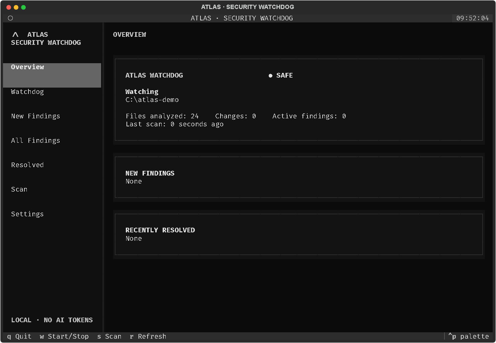

# ATLAS v0.1.8

## Painel integrado

Execute `atlas` ou `atlas dashboard` para abrir o painel integrado, com scans,
severidades, histórico, atividades e conversa no mesmo terminal. O comando
`atlas agent` agora abre esse painel; o backend de chat separado não é iniciado.
A conversa usa Ollama quando disponível e informa explicitamente quando a análise
por IA não pôde ser executada. Scanners locais continuam disponíveis sem modelo.
Selecione o projeto no campo superior e pressione Enter. Clique em um scan para
consultar os findings atuais daquele projeto. Ctrl+S inicia scan, Ctrl+W alterna
Watch, Ctrl+R gera relatório e Ctrl+Q sai. A arte é adaptada para caracteres de
terminal; números e versão são os reais da instalação.

O banner reutiliza a garota do menu preto original em caracteres Braille
brancos, sem navegador ou mosaico cinza. Use Windows Terminal com uma fonte monoespaçada;
uma janela de 120 × 40 ou maior oferece melhor leitura. A navegação selecionada,
os painéis e as barras de severidade têm destaque próprio.

No Windows, o painel tenta iniciar silenciosamente o Ollama instalado em
`%LOCALAPPDATA%\Programs\Ollama` (ou `OllamaCPU`). O modelo precisa estar baixado:
`ollama pull qwen2.5-coder:3b`. O rodapé verifica novamente a disponibilidade a
cada 30 segundos. Ter o serviço iniciado não significa que o modelo já esteja
disponível. O Watch local continua funcionando sem Ollama.

**Leitura automática no chat:** a cada pergunta, o ATLAS busca nomes e conteúdo
em até 64 arquivos elegíveis e envia trechos de até 8 arquivos ao modelo.
Prioriza nomes citados, funções, linhas explícitas (como `src/app.py:180`) e
alterações recentes. Os trechos podem vir do meio do arquivo, preservando as linhas
originais. O cache guarda somente conteúdo sanitizado, em memória, e é atualizado
quando o arquivo muda. Fontes e cobertura parcial aparecem na resposta.
Ignora `.env`, dependências, arquivos privados e binários, e oculta linhas com
possíveis credenciais. O contexto é limitado a 12 mil caracteres; não representa
uma varredura completa do computador. O modelo não executa comandos.
`atlas watch "C:\MeuProjeto" --ai`
habilita revisões explícitas locais. O Watch nunca envia findings automaticamente;
selecione um finding e pressione `a` para solicitar a revisão. No painel, `/ai on`
habilita a capacidade, mas a análise ocorre após uma pergunta explícita no chat.
Ollama e o modelo são instalações separadas do ATLAS.

O chat mantém as últimas interações somente na memória da sessão e do projeto.
`/context` mostra as fontes utilizadas; `/clear` limpa a conversa e o cache.
Use `atlas agent --in "C:\MeuProjeto" --model qwen2.5-coder:3b` para escolher
o projeto e um modelo local instalado. Trocar o projeto também limpa o contexto.

O Watch reanalisa por inteiro os arquivos alterados, incluindo os achados que
continuam presentes. Isso evita marcar um risco como resolvido quando apenas
outra linha do mesmo arquivo mudou. A seleção dos arquivos continua incremental.
Findings exibem categoria e confiança estimada. Uma supressão individual requer
motivo e prazo; ela continua visível no painel com estado `SUPPRESSED`.

## Precisão e estabilidade da v0.1.8

- Baseline inicial silenciosa: findings preexistentes começam como EXISTING.
- Fingerprints usam contexto sanitizado e resistem a inserções em outras linhas.
- Secrets exigem valor plausível; placeholders, fixtures e dependências são ignorados.
- Security Score separado por credenciais, rede, containers, host e código.
- Scans abandonados são recuperados, e a fase atual aparece no painel.
- Baseline não é reaplicada em cada reinício do Watchdog.
- Scans incrementais são apresentados como escopo alterado, não como scan completo do projeto.

Para testar esta copia local:

```powershell
python -m pip install .
atlas watch "C:\Meu Projeto"
```

O Watch nao detecta todos os erros possiveis. As ferramentas opcionais ampliam
a cobertura; resultados continuam exigindo revisão humana. Consulte a release
v0.1.8 para o código e o executável. Veja as limitações detalhadas em
`IMPLEMENTATION_REPORT.md`.

ATLAS is a defensive Security Watchdog for Windows that runs entirely in the
terminal. It watches a source tree, scans changed code with local tools, and
reports only findings that are new since the previous measured scan.

It is independent of Codex, Cursor, Claude Code, IDEs, and editors. The core
watch mode does not call an LLM and does not consume AI tokens.

> Alpha software. ATLAS reduces review time but does not guarantee that a
> system or project is free of vulnerabilities.

## Download rápido (Windows)

Quer apenas usar? Baixe o executável pronto na página da release:

**[Baixar ATLAS-Security-Agent.exe — v0.1.8](https://github.com/MarcioConnect/atlas/releases/download/v0.1.8/ATLAS-Security-Agent.exe)**

Depois, no PowerShell:

```powershell
.\ATLAS-Security-Agent.exe --version
.\ATLAS-Security-Agent.exe monitor start
```

The release includes `ATLAS-Security-Agent.exe.sha256`. Verify that the download
was not corrupted before running it:

```powershell
$expected = (Get-Content .\ATLAS-Security-Agent.exe.sha256).Split(' ')[0]
$actual = (Get-FileHash .\ATLAS-Security-Agent.exe -Algorithm SHA256).Hash.ToLower()
if ($actual -ne $expected) { throw "ATLAS checksum mismatch" }
"ATLAS checksum OK"
```

The v0.1.8 executable is not Authenticode-signed; Windows may show a publisher
warning. A checksum detects corruption but does not independently prove who
published the file. See [`docs/SIGNING.md`](docs/SIGNING.md).

Não precisa instalar Python, Git ou abrir navegador. A logo usada pelo
executável está disponível em [`assets/atlas.ico`](assets/atlas.ico).

Para instalar como pacote Python e usar o comando `atlas`, siga a seção de
instalação abaixo.

## v0.1 implementation status

The core workflow is functional:

```text
CODE CHANGES
    -> ATLAS detects the filesystem event
    -> waits for the debounce window
    -> runs available local scanners
    -> compares stable fingerprints with the previous measured state
    -> stores NEW / EXISTING / RESOLVED in SQLite
    -> refreshes the terminal TUI
```

Validation completed on Windows:

- 126 automated tests passing on the local Windows/Python 3.14 environment;
- real filesystem event detection verified;
- repeated events coalesced by debounce;
- `NEW -> EXISTING -> RESOLVED` lifecycle verified end to end;
- paths containing spaces verified;
- missing optional scanners verified without crashes;
- consecutive unchanged scans verified without repeated findings;
- source tree checked with zero exposed-secret findings;
- package metadata validated for `pip install .`;
- Textual Watchdog TUI opened and exercised in Windows Terminal.

Current optional-tool availability depends on the host. ATLAS always keeps the
built-in scanner active and prints an installation command for each missing
scanner.

## Screenshot



See [`docs/screenshots/README.md`](docs/screenshots/README.md) for reproducible
capture steps.

## Requirements

- Windows 10 or Windows 11
- PowerShell 7 and Windows Terminal recommended
- Python 3.11 or newer
- Administrator privileges are **not** required to scan source code

Optional scanners are detected at runtime. Missing tools never stop the ATLAS
Native scanner or another available scanner.

## Installation

To install from the source ZIP, use **Code > Download ZIP** on GitHub, extract
it, open PowerShell in that folder, and run:

```powershell
py -m pip install .
atlas --version
```

Git is not required. To upgrade a previously installed copy, use
`py -m pip install --upgrade .` from the newly extracted release folder.

If the GitHub release provides `ATLAS-Security-Agent.exe`, Python is not needed
for normal use. Download the executable and run:

```powershell
.\ATLAS-Security-Agent.exe --version
.\ATLAS-Security-Agent.exe monitor start
```

For development:

```powershell
python -m pip install -e ".[dev]"
```

To build the standalone Windows executable with the ATLAS icon and process
identity:

```powershell
.\tools\build_windows.ps1
.\release\ATLAS-Security-Agent.exe monitor start
```

The resident monitor then appears in Task Manager as
`ATLAS-Security-Agent.exe`, with the bundled ATLAS icon instead of `python.exe`.
The one-file Windows build can appear as two grouped ATLAS processes while it
is active: the PyInstaller launcher and the resident agent. Both use the ATLAS
name and icon.

Optional Windows notifications and Python scanners:

```powershell
python -m pip install ".[desktop]"
python -m pip install ".[python-scanners]"
```

The runtime dependency source of truth is `pyproject.toml`.

## Quick start

Run a one-time project scan without opening the monitoring TUI:

```powershell
atlas scan
atlas scan "C:\Meu Projeto"
atlas scan "C:\Meu Projeto" --format json
```

The command scans the current directory by default. It lists active findings
and warns when optional scanners are missing. Source files over 2 MB are skipped
to bound resource use; they are counted, and the result is marked as partial
coverage rather than implying the project was fully analyzed.

Start continuous monitoring with the interactive view:

```powershell
atlas watch "C:\Meu Projeto"
```

For continuous monitoring of every saved project in the background:

```powershell
atlas monitor start
atlas monitor status
```

ATLAS opens a Textual TUI in the current terminal. Keep it running while using
any editor or coding agent. Relevant changes are coalesced with a two-second
debounce, scanned locally, reconciled with SQLite, and displayed as `NEW`,
`EXISTING`, or `RESOLVED`.

To monitor every existing project path saved in ATLAS, omit the path or use
`--all`:

```powershell
atlas watch
atlas watch --all
```

The multi-project TUI shows each project's status, scan counters, and new
findings in one screen. If no paths are configured, first run for example:

```powershell
atlas monitor start --watch "C:\Meu Projeto"
```

Run one scan without opening the TUI:

```powershell
atlas watch "C:\Meu Projeto" --once
```

Enable optional local AI review with Ollama:

```powershell
winget install Ollama.Ollama
ollama pull qwen2.5-coder:3b
atlas watch "C:\Meu Projeto" --ai
```

`--ai` only enables the review capability. Scans do not call the model
automatically; select a finding in the TUI and press `A` to explicitly request
a review. ATLAS sends sanitized, short source excerpts exclusively to
`127.0.0.1:11434`, requests structured JSON, exposes no tools to the model, and
never executes model output. Use `--ai-model MODEL` to select another local model.

Use `--silent` to keep the watcher quiet, or persist rule exclusions with
`--ignore-rule`:

```powershell
atlas watch "C:\Meu Projeto" --silent
atlas watch "C:\Meu Projeto" --notify
atlas watch "C:\Meu Projeto" --ignore-rule hardcoded-secret
```

The native scanner uses an in-memory file snapshot to inspect only changed
lines after the first observation. Optional scanners remain scoped to the
changed files and unavailable tools are reported without stopping the watch.
When `winotify` is installed, new findings also generate a Windows desktop
notification; otherwise the TUI remains the source of truth.

## Generate Report

Use **4. Generate Report** in the launcher (or activate it with the keyboard)
to write a local Markdown report containing the latest system Security Score,
Watchdog findings, scanner status, evidence, risk, recommendations, and the
sanitized file-change history for each known project. Without `--project`, the
report consolidates all configured and previously scanned projects. The
file is saved in your Windows Downloads folder as
`atlas-report-YYYY-MM-DD.md`; an existing report is never overwritten and a
time suffix is used when necessary. All report fields are sanitized and
sensitive values are replaced with `[REDACTED]`.

Reports can also be generated directly from the CLI:

```powershell
atlas report --format md
atlas report --format html
atlas report --format json
atlas report --project "C:\Meu Projeto" --output "C:\Relatorios"
```

## Watchdog TUI

Views: Overview, Watchdog, New Findings, All Findings, Resolved, Scan, and
Settings.

Keyboard shortcuts:

- `W`: start or stop watching
- `S`: run a full manual scan
- `Enter`: open details for the selected finding
- `A`: request a local AI review of the selected finding when started with `--ai`
- `R`: refresh
- `Q`: quit

## Supported files

ATLAS records create, modify, move, and delete events for every non-ignored
file. Security scans prioritize `.html`, `.py`, `.js`, `.ts`, `.tsx`, `.jsx`,
`.ps1`, `.bat`, `.json`, `.yaml`, `.yml`, `Dockerfile`, and Compose files.
File contents are never stored in the activity history.

It ignores VCS metadata, `node_modules`, virtual environments, `site-packages`,
Python caches, test/build artifacts, `dist`, and `build`.

## Scanners

| Scanner | Scope | Optional install |
|---|---|---|
| ATLAS Native | Secrets, risky APIs, exposed binds, Docker basics | Built in |
| ATLAS Security Guard | Prompt injection, exfiltration chains, obfuscation, tool abuse | Built in |
| Microsoft Defender | Malware/spyware state and detection history on Windows | Built into Windows |
| Executable inspection | Streaming SHA-256 and Authenticode status; unsigned is not proof of malware | Built into Windows |
| YARA | Optional scanning with selected local rules and bounded runtime | `py -m pip install 'atlas-security-agent[yara]'` |
| Ollama AI | Explicit review of a selected, sanitized finding or user-requested chat context | `winget install Ollama.Ollama` |
| Semgrep | Multi-language static analysis | `python -m pip install semgrep` |
| Bandit | Python security linting | `python -m pip install bandit` |
| pip-audit | Python dependencies | `python -m pip install pip-audit` |
| npm audit | npm dependencies | Install Node.js/npm |
| PSScriptAnalyzer | PowerShell analysis | `Install-Module PSScriptAnalyzer -Scope CurrentUser` |
| Trivy | Dependencies, containers, misconfigurations, secrets | `winget install AquaSecurity.Trivy` |

Some dependency scanners may need network access to refresh advisory databases.
This does not involve an LLM or AI tokens.

## Other commands

```powershell
atlas                         # native ATLAS dashboard + conversation TUI
atlas scan [PROJECT]          # análise pontual local; --format json opcional
atlas agent                   # conversa do agente ATLAS no terminal
atlas agent --advanced        # exige o chat avançado do ATLAS
atlas dashboard               # system security dashboard
atlas security                # read-only machine scan
atlas malware status          # Defender protection and detection status
atlas malware scan "C:\Path" # custom Defender scan without automatic remediation
atlas malware inspect "C:\Path\program.exe" # hash/signature metadata; does not execute the file
atlas malware yara "C:\Path" --rules "C:\Trusted-YARA-Rules" # optional local rules only
atlas monitor start           # background events + code Watchdogs for all configured paths
atlas monitor install         # start now and register ATLAS for Windows login
atlas monitor status
atlas monitor events
atlas monitor stop
atlas config                  # mostra caminhos, regras ignoradas e severidades
atlas start                   # controlled operational session
atlas stop
atlas history
```

Persist projects and customize findings without editing files manually:

```powershell
atlas config --add-path "C:\Meu Projeto"
atlas config --ignore-rule RULE-ID
atlas config --unignore-rule RULE-ID
atlas config --risk RULE-ID=HIGH
atlas config --suppress-finding FINGERPRINT="Reason" --suppression-days 30
atlas config --unsuppress-finding FINGERPRINT
```

## Finding lifecycle

A stable SHA-256 fingerprint uses scanner, rule, normalized project-relative
file path, and a sanitized source-context identity. It survives unrelated line
insertions without storing source or secret values. The initial Watch baseline
is accepted as EXISTING, so only later regressions become NEW. On every scan:

- `NEW`: not active in the previous measured state, or it reappeared;
- `EXISTING`: still present;
- `RESOLVED`: absent from a scanner/file scope that was successfully measured.

An unavailable scanner has no coverage and therefore cannot accidentally mark
its older findings as resolved.

Confidence is a rule/context heuristic for triage, not a calibrated probability.
Missing scanners and eligible source files over 2 MB are shown as coverage gaps;
they are never described as cleanly analyzed.
Incremental Watchdog results explicitly cover only changed files and are not
reported as a complete project scan. The initial baseline is accepted once per
project; subsequent Watchdog starts still report newly discovered findings.

## Privacy and safety

ATLAS is read-only by default and never exploits vulnerabilities. Evidence is
sanitized before display or storage. Passwords, tokens, API keys, cookies,
connection strings, private keys, `.env` values, and common credential formats
are replaced with `[REDACTED]` or omitted entirely.

Security Guard uses heuristic patterns on supported scanned source files to flag
possible prompt injection, exfiltration and encoded instruction sequences.
It is not a semantic security guarantee or a global interceptor for browsers,
emails, tools or other agents. The Ollama reviewer receives source as untrusted
data and has no execution tools; prompt instructions alone cannot guarantee that
a model will ignore every injection. Results still require human review.

For ordinary file activity, ATLAS stores only sanitized metadata: timestamp,
event type, severity, and path. It does not store file contents. Sensitive
filenames are replaced with `[SENSITIVE_FILE]`.

## v0.1 limitations

- Windows is the primary supported platform; other systems are best effort.
- Optional scanner accuracy and coverage depend on installed versions and rules.
- Semgrep `auto` configuration and vulnerability databases can require network access.
- Protected machine-wide checks may be incomplete without Administrator access;
  ATLAS reports reduced coverage rather than failing.
- `atlas agent` opens the integrated panel. Legacy advanced-backend options do
  not enable external agents. Chat uses Ollama when available, otherwise local rules.
- The native scanner is intentionally conservative and is not a replacement for
  specialist scanners or a professional security review.
- Ollama improves context but can still make mistakes; deterministic scanners
  remain authoritative and AI review is clearly labelled.
- ATLAS complements Microsoft Defender. It is not an antivirus engine and cannot
  guarantee detection of every malware, spyware, rootkit or zero-day attack.
- Defender telemetry can require Administrator access under corporate policy;
  ATLAS reports this limitation instead of bypassing it.

## Development

```powershell
python -m pytest -q
atlas --version
atlas watch . --once
.\tools\build_windows.ps1
.\release\ATLAS-Security-Agent.exe --version
```

`atlas monitor start` runs in the background and starts one local code Watchdog
per existing configured path. All non-ignored file changes are recorded as
sanitized metadata; supported source/configuration files are debounced, scanned locally, and
reconciled as `NEW`/`EXISTING`/`RESOLVED`. AI remains opt-in with `atlas watch --ai`. Use
`atlas monitor status` and `atlas monitor events` to inspect the resident
service.

See [CHANGELOG.md](CHANGELOG.md) for release notes.

## GitHub release checklist

- [x] Runtime dependencies declared in `pyproject.toml`
- [x] CLI, Watchdog, debounce, lifecycle, redaction, and TUI tests
- [x] `README.md`, `LICENSE`, `.gitignore`, and `CHANGELOG.md`
- [x] PyPI-compatible package metadata
- [x] Add the final sanitized TUI screenshot
- [x] MIT copyright holder set to `ATLAS contributors`
- [x] Install and execute the built wheel in an isolated Windows environment
- [ ] Let GitHub Actions validate the Python 3.11/3.12/3.13 matrix after push
- [x] Build and inspect wheel and source distribution
- [ ] Create the GitHub repository, review staged files, and tag `v0.1.0`
